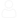

  

    <h2> Plateforme </h2>
    

        
        <button class='button button_tags' data-filter=".{{plateform}}">{{plateform}}</button>
        
        <button class='button button_tags button_plateform is-checked'  data-filter="">Tout</button>
    

    <h2> Sujet </h2>
    

        
        <button class='button button_tags' data-filter=".{{categorie}}">{{categorie}}</button>
        
        <button class='button button_tags button_categorie is-checked'  data-filter="*">Tout</button>
    

  

  

    <label for="search">Recherche</label>
  

  

    
    <input type="search" class="quicksearch" placeholder="Créateurs, créatrices, mot-clé.." name="search" id='search' />
    <button class='button button_tags' onclick="shuffleCard()" >Aléatoire</button>
  

<section class="Grid">
<h2 class="ReaderOnly">Les créateurs répondants correspondants aux critères sélectionnés</h2>
  

        
				
            <article class="Card {{creators.categories}} {{creators.plateforms}}">
                <h3 class='Card__title'>
                    
                    
                    
                    
                    
                    
@{{ creators.global_name }}

                </h3>
                <!--div class="categories">
                  

                    #Python
                  

                  

                    #IA
                  

                </div-->
                

                    
                        {{ creators.youtube_description | newline_to_br}}
                    
                        {{ creators.twitch_description |  newline_to_br}}
                    
                

                <footer class="SocialNetworks">
                  
                  <a class="CallToAction Network Network--twitter" rel="noopener" href='https://twitter.com/@{{ creators.twitter_screen_name| markdownify | strip_html}}' target="_blank">
                    <i class="fab fa-twitter"></i>
                    twitter
                    {{ creators.twitter_followers }}
                  </a>
                  
                  
                  <a class='CallToAction Network Network--youtube' rel="noopener" href='https://youtube.com/channel/{{ creators.youtube_channel_id | markdownify | strip_html }}' target="_blank">
                    
                    youtube
                    {{ creators.youtube_subscriber_count}}
                  </a>
                       
                  
                  <a class='CallToAction Network Network--twitch' rel="noopener" href='https://twitch.com/{{ creators.twitch_channel_name | markdownify | strip_html }}' target="_blank">
                    <i class="fab fa-twitch"></i>
                    twitch
                    {{ creators.twitch_followers}}
                  </a>
                  
                </footer>
                <!--div class="votes-container">
                  
345 votes

                  

                    
                      
                    
                    
                      
                    
                  

                </div-->         
        </article>
				
        
</section>

